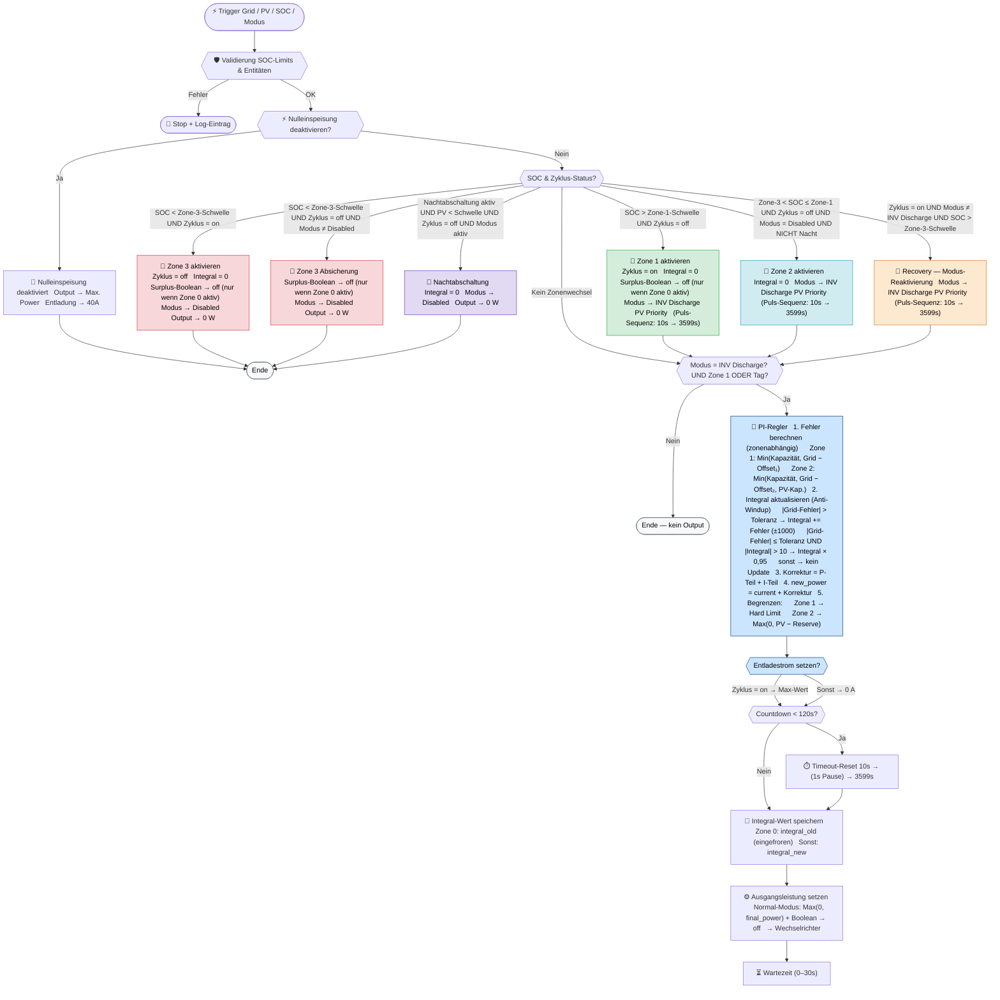

```mermaid
    flowchart TD
        START([⚡ Trigger Grid / PV / SOC / Modus]) --> VAL

        VAL{{"🛡️ Validierung SOC-Limits & Entitäten"}}
        VAL -- Fehler --> STOP([🛑 Stop + Log-Eintrag])
        VAL -- OK --> FULL_POWER_CHECK

        FULL_POWER_CHECK{{"⚡ Nulleinspeisung deaktivieren?"}}
        FULL_POWER_CHECK -- Ja --> FULL_POWER_ACTION["🔋 Nulleinspeisung deaktiviert   Output → Max. Power   Entladung → 40A"]
        FULL_POWER_CHECK -- Nein --> ZONE_CHECK
        
        FULL_POWER_ACTION --> END_STOP([Ende])

        ZONE_CHECK{{"SOC & Zyklus-Status?"}}

        %% ── Zone 1 ──────────────────────────────────────────────────
        ZONE_CHECK -- "SOC > Zone-1-Schwelle UND Zyklus = off" --> Z1_START
        Z1_START["🔋 Zone 1 aktivieren   Zyklus = on   Integral = 0   Surplus-Boolean → off (nur wenn Zone 0 aktiv)   Modus → INV Discharge PV Priority   (Puls-Sequenz: 10s → 3599s)"]

        %% ── Zone 3 (Zyklus on) ──────────────────────────────────────
        ZONE_CHECK -- "SOC < Zone-3-Schwelle UND Zyklus = on" --> Z3_A
        Z3_A["🛑 Zone 3 aktivieren   Zyklus = off   Integral = 0   Surplus-Boolean → off (nur wenn Zone 0 aktiv)   Modus → Disabled   Output → 0 W"]

        %% ── Zone 3 (Absicherung) ────────────────────────────────────
        ZONE_CHECK -- "SOC < Zone-3-Schwelle UND Zyklus = off UND Modus ≠ Disabled" --> Z3_B
        Z3_B["🛑 Zone 3 Absicherung   Surplus-Boolean → off (nur wenn Zone 0 aktiv)   Modus → Disabled   Output → 0 W"]

        %% ── Recovery ────────────────────────────────────────────────
        ZONE_CHECK -- "Zyklus = on UND Modus ≠ INV Discharge UND SOC > Zone-3-Schwelle" --> RECOVERY
        RECOVERY["🔄 Recovery — Modus-Reaktivierung   Modus → INV Discharge PV Priority   (Puls-Sequenz: 10s → 3599s)"]

        %% ── Zone 2 ──────────────────────────────────────────────────
        ZONE_CHECK -- "Zone-3 < SOC ≤ Zone-1 UND Zyklus = off UND Modus = Disabled UND NICHT Nacht" --> Z2_START
        Z2_START["🔋 Zone 2 aktivieren   Integral = 0   Modus → INV Discharge PV Priority   (Puls-Sequenz: 10s → 3599s)"]

        %% ── Nachtabschaltung ────────────────────────────────────────
        ZONE_CHECK -- "Nachtabschaltung aktiv UND PV < Schwelle UND Zyklus = off UND Modus aktiv" --> NIGHT
        NIGHT["🌙 Nachtabschaltung   Integral = 0   Modus → Disabled   Output → 0 W"]

        %% ── Kein Zonenwechsel ───────────────────────────────────────
        ZONE_CHECK -- "Kein Zonenwechsel" --> PI_GATE

        Z1_START --> PI_GATE
        Z2_START --> PI_GATE
        RECOVERY --> PI_GATE
        Z3_A --> END_STOP([Ende])
        Z3_B --> END_STOP
        NIGHT --> END_STOP

        %% ── PI-Regler Gate ──────────────────────────────────────────
        PI_GATE{{"Modus = INV Discharge? UND Zone 1 ODER Tag?"}}
        PI_GATE -- Nein --> END_SKIP([Ende — kein Output])
        PI_GATE -- Ja --> CALC_NORMAL


        %% ── PI-Pfad ────────────────────────────────────────
        CALC_NORMAL["🧠 PI-Regler   1. Fehler berechnen (zonenabhängig)      Zone 1: Min(Kapazität, Grid − Offset₁)      Zone 2: Min(Kapazität, Grid − Offset₂, PV-Kap.)   2. Integral aktualisieren (Anti-Windup)      |Grid-Fehler| > Toleranz → Integral += Fehler (±1000)      |Grid-Fehler| ≤ Toleranz UND |Integral| > 10 → Integral × 0,95      sonst → kein Update   3. Korrektur = P-Teil + I-Teil   4. new_power = current + Korrektur   5. Begrenzen:      Zone 1 → Hard Limit      Zone 2 → Max(0, PV − Reserve)"]
        CALC_NORMAL --> DISCHARGE_SET

        %% ── Entladestrom setzen ─────────────────────────────────────
        DISCHARGE_SET{{"Entladestrom setzen?"}}
        DISCHARGE_SET -- "Zyklus = on → Max-Wert" --> TIMEOUT_CHECK
        DISCHARGE_SET -- "Sonst → 0 A" --> TIMEOUT_CHECK

        %% ── Timeout ─────────────────────────────────────────────────
        TIMEOUT_CHECK{{"Countdown < 120s?"}}
        TIMEOUT_CHECK -- Ja --> TIMEOUT_RESET["⏱️ Timeout-Reset 10s → (1s Pause) → 3599s"]
        TIMEOUT_CHECK -- Nein --> INTEGRAL_SAVE
        TIMEOUT_RESET --> INTEGRAL_SAVE

        %% ── Integral & Output ───────────────────────────────────────
        INTEGRAL_SAVE["💾 Integral-Wert speichern   Zone 0: integral_old (eingefroren)   Sonst: integral_new"]
        INTEGRAL_SAVE --> SET_OUTPUT

        SET_OUTPUT["⚙️ Ausgangsleistung setzen    Normal-Modus: Max(0, final_power) + Boolean → off   → Wechselrichter"]
        SET_OUTPUT --> WAIT["⏳ Wartezeit (0–30s)"]

        %% ── Styles ──────────────────────────────────────────────────
        classDef zone0 fill:#fff3cd,stroke:#f0ad4e,color:#000
        classDef zone1 fill:#d4edda,stroke:#28a745,color:#000
        classDef zone2 fill:#d1ecf1,stroke:#17a2b8,color:#000
        classDef zone3 fill:#f8d7da,stroke:#dc3545,color:#000
        classDef night fill:#e2d9f3,stroke:#6f42c1,color:#000
        classDef recovery fill:#fde8d0,stroke:#e07b20,color:#000
        classDef pi fill:#cce5ff,stroke:#004085,color:#000
        classDef end_node fill:#f8f9fa,stroke:#6c757d,color:#000

        class Z1_START zone1
        class Z2_START zone2
        class Z3_A,Z3_B zone3
        class NIGHT night
        class RECOVERY recovery
        class CALC_NORMAL,DISCHARGE_SET pi
        class END_STOP,END_SKIP,END_TOL,END_OK,BOOL_UPDATE end_node
```
